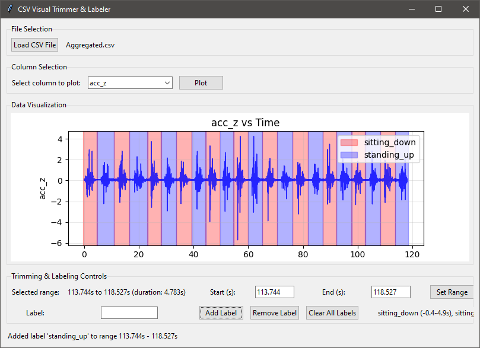
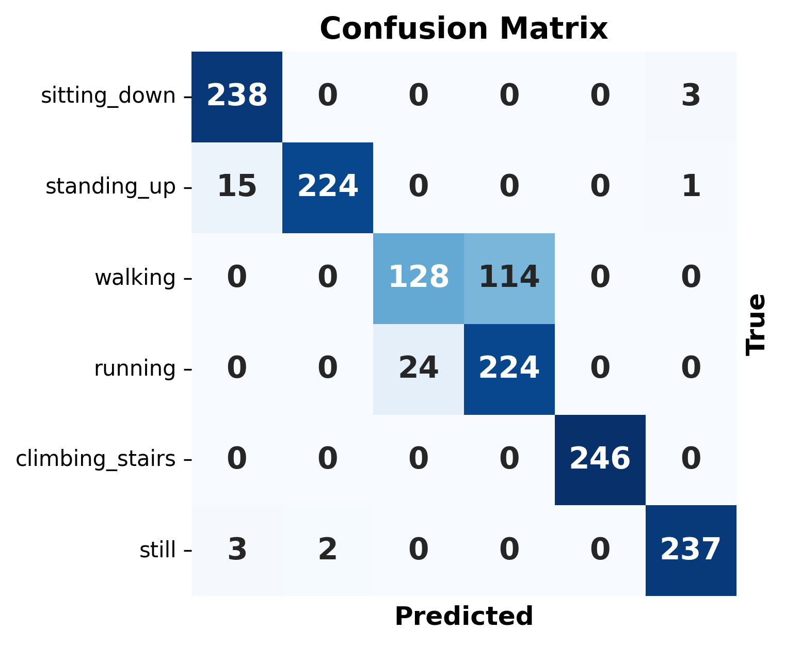

<p align="center">
  
</p>

---

This project goal is to accurately predict human activity based on mobile sensor data such as gyroscope, accelerometer and gravity. It consists of a full Data Science pipeline from data acquisition until model inference 

## Data Processing

To add a new action type, follow these steps:

1. Create a new folder for the action type inside the `data` directory.
2. Place the zip file containing the sensor data (Gyroscope.csv, Accelerometer.csv, Gravity.csv) inside the newly created folder.
3. Run the `prepare` step to extract the zip files and aggregate them:
```bash
python preprocess.py --prepare
```
4. Use the `csv_trimmer.py` script to label the data and remove any unwanted sections. 

<p align="center">
  
</p>

5. Run the `merge` option to generate a complete `data/merged_data.csv` with all activity data labeled and grouped by session
```bash
python preprocess.py --merge
```

> Note: To ensure class balance, make sure the new activity data contains 60 seconds of clean sensor data

## Model Training

To get started with model training, you need to define a model that inherits from the `BaseModel` class inside the `src/ml/base_model.py` file. The model **must** implement the following two core methods:
 
```python
    @abstractmethod
    def fit(self, X, y, labels):
        pass 

    @abstractmethod
    def predict(self, X):
        pass 
```

Where `X` is a `np` array with shape (num_windows, window_size, num_features) and `y` is a `np` array with shape (num_windows,)

Once you have defined your model, plug it in the training pipeline (`run_pipeline.py`) and run it using the following command:

```bash
python run_pipeline.py
```

The current **highest score** on the test set is **88.9%** using **Random Forest** (see `src/models/baseline.py`). After running the pipeline, if your model scores a higher accuracy on the test set it will be automatically saved under `models/` with its corresponding *confusion matrix* under `results/`:

<p align="center">
  
</p>
